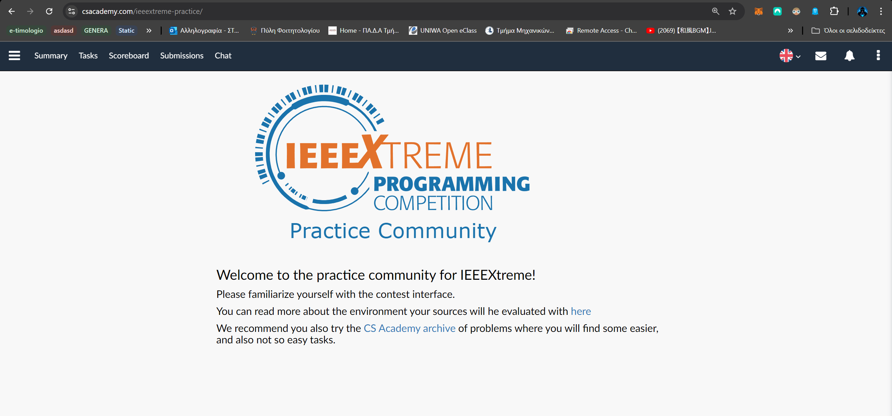
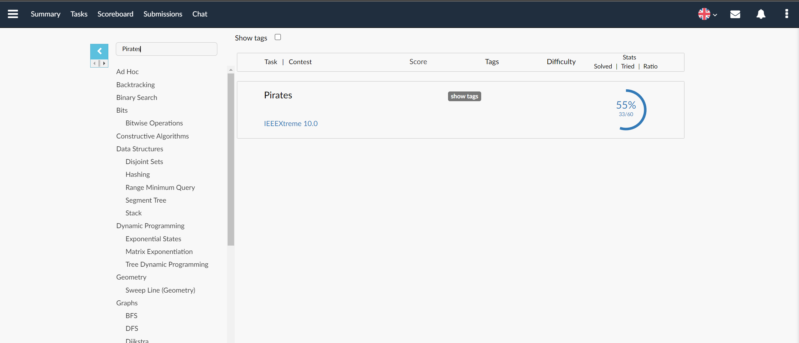
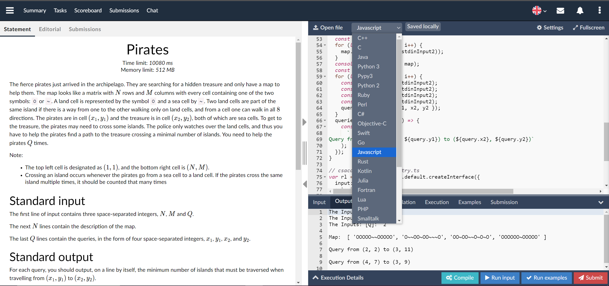
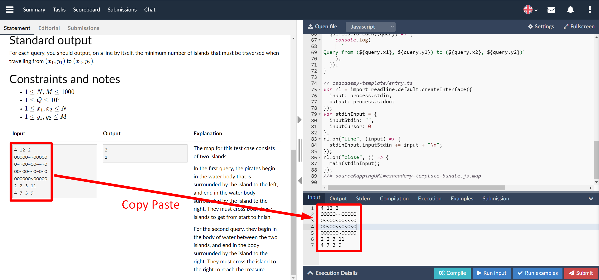

# What is this Repository about?

This repository contains solutions for Coding Challenges from [CS Academy](https://csacademy.com/ieeextreme-practice). The solutions are implemented in **Typescript**.

# How to use this Repository

1. You will need to install the `tsx` compiler to run the solutions. This tool allows you to run Typescript files directly (without compiling them to JS). You can install it by running the following command:

```bash
npm install -g tsx
```

2. Next, you should download and install the dependencies for this project. Your terminal must need to navigated to where the package.json file is located. To install the dependencies, run the following command:

```bash
npm i
```

3. Finally, you should be able to run the solutions by running the following command (e.g. tsx ./minimum-permutation.ts):

```bash
tsx <path-to-solution-file>.ts
```

## How to upload solutions to CS Academy

CS Academy allows you to upload your code solution to their platform, where you can test it against their test cases. To upload your solution, follow these steps:

1. **Log in**, use your IEEE Account to log in.



2. **Navigate to the Problem**, you want to solve.



3. **Select the Programming Language**, here select Javascript.



4. **Copy the code** (or use Open File to upload), and paste it into the editor.

5. Copy the Input from the description, to the input down right.



6. **Run the code**, and check the output.

## Understanding how to setup a new Challenge

1. To start a new challenge, copy and paste the csacademy-template directory.
2. Rename the copy to the challenge name (e.g: pirates, hive, etc.).
3. Inside the folder, the following files should stay the same or extended if needed:

   - `entry.ts`
   - `utils.ts`

4. Your solution should be implemented in the `main.ts`.

5. Once you are done, you must use ESBuild to **bundle the code**. To do so, follow the steps below:

   1. Go to _bundle.ts_ file (its in the root directory).
   2. Add your challenge to the `directories` array (there are already some examples there).
   3. Run the following command:

   ```bash
    tsx ./bundle.ts
   ```

   4. Once the command is executed, a `dist` folder should be created with the bundled code.
   5. Copy the code from the `dist/${challenge-name.js}` and paste it into the CS Academy editor.

"# ieeextreme-practise";
